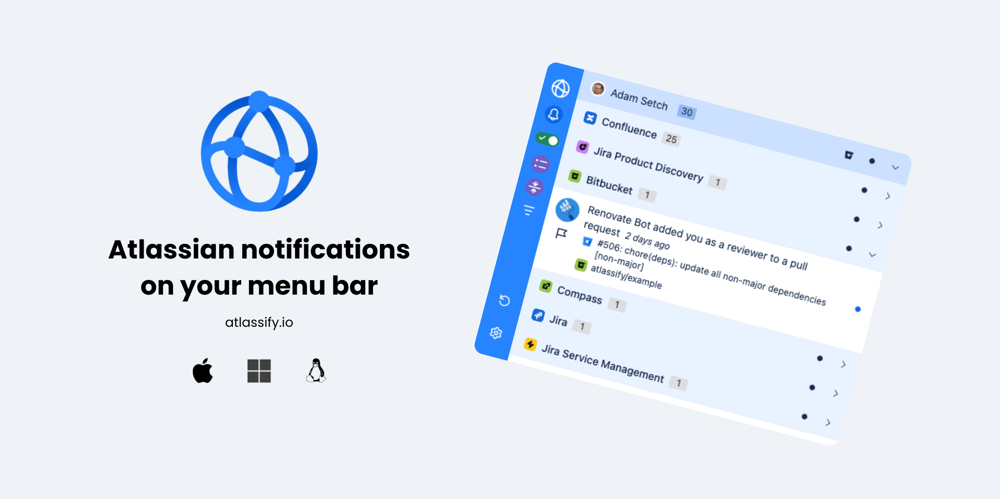

# Atlassify 

[![Build Workflow][build-workflow-badge]][github-actions] [![Release Workflow][release-workflow-badge]][github-actions] [![Coverage][coverage-badge]][coverage] [![Quality Gate Status][quality-badge]][quality] [![Renovate enabled][renovate-badge]][renovate] [![Libraries.io dependency status][librariesio-badge]][librariesio] [![Contributors][contributors-badge]][github] [![Downloads - Total][downloads-total-badge]][website] [![Downloads - Latest Release][downloads-latest-badge]][website] [![OSS License][license-badge]][license] [![Latest Release][github-release-badge]][github-releases]

> Atlassian notifications on your menu bar. Available on macOS, Windows and Linux.



### Download

You can download Atlassify for **free** from the website [www.atlassify.io][website], or via [Homebrew][brew].

```shell
brew install --cask setchy/brews/atlassify
```

Atlassify supports macOS, Windows and Linux.

### FAQ

Please visit our [Atlassify FAQs][faqs] for all commonly asked questions.

### Contributing

Please read our [Contributing Guidelines](CONTRIBUTING.md) for more information.

### License

Atlassify is licensed under the MIT Open Source license. 
For more information, see [LICENSE](LICENSE).


### Attribution

I would like to acknowledge the following projects and resources that have inspired and contributed to the development of Atlassify:

1. [Gitify][attribution-gitify] - An open-source GitHub notification app which I also maintain and served as an launchpad for Atlassify.
2. [Atlassian Design System][attribution-atlassian] - The design principles and components from Atlassian that helped shape the user interface of Atlassify.


<!-- LINK LABELS -->
[website]: https://www.atlassify.io
[faqs]: https://www.atlassify.io/faq/
[github]: https://github.com/setchy/atlassify
[github-actions]: https://github.com/setchy/atlassify/actions
[github-releases]: https://github.com/setchy/atlassify/releases/latest
[github-website]: https://github.com/setchy/atlassify-website
[github-website-pulls]: https://github.com/setchy/atlassify-website/pulls
[brew]: https://brew.sh/
[coverage-badge]: https://img.shields.io/sonar/coverage/setchy_atlassify?server=https%3A%2F%2Fsonarcloud.io&logo=sonarcloud
[coverage]: https://sonarcloud.io/summary/new_code?id=setchy_atlassify
[quality-badge]: https://img.shields.io/sonar/quality_gate/setchy_atlassify?server=https%3A%2F%2Fsonarcloud.io&logo=sonarcloud
[quality]: https://sonarcloud.io/summary/new_code?id=setchy_atlassify
[build-workflow-badge]: https://github.com/setchy/atlassify/actions/workflows/build.yml/badge.svg
[release-workflow-badge]: https://github.com/setchy/atlassify/actions/workflows/release.yml/badge.svg
[downloads-total-badge]: https://img.shields.io/github/downloads/setchy/atlassify/total?label=downloads@all&logo=github
[downloads-latest-badge]: https://img.shields.io/github/downloads/setchy/atlassify/latest/total?logo=github
[contributors-badge]: https://img.shields.io/github/contributors/setchy/atlassify?logo=github
[librariesio]: https://libraries.io/
[librariesio-badge]: https://img.shields.io/librariesio/github/setchy/atlasify?logo=librariesdotio
[license]: LICENSE
[license-badge]: https://img.shields.io/github/license/setchy/atlassify?logo=github
[github-release-badge]: https://img.shields.io/github/v/release/setchy/atlassify?logo=github
[renovate]: https://renovatebot.com/
[renovate-badge]: https://img.shields.io/badge/renovate-enabled-brightgreen.svg?logo=renovate

[attribution-gitify]: https://gitify.io
[attribution-atlassian]: https://atlassian.design/
